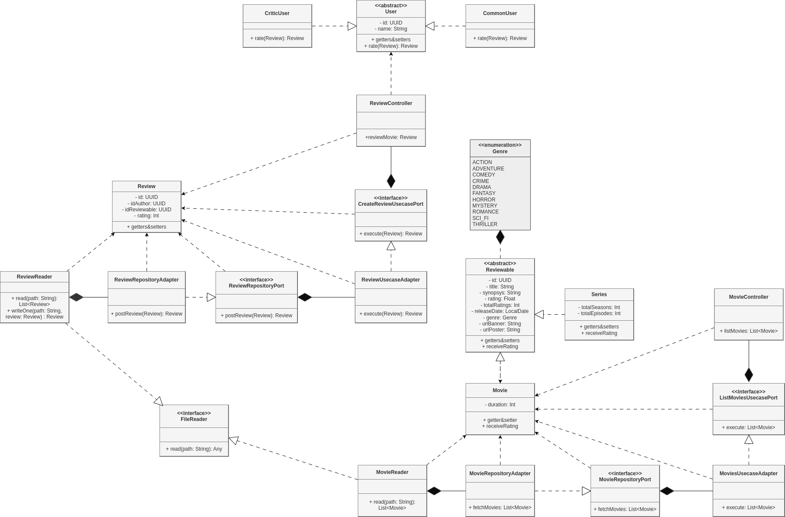

<h1 align="center">Rotten Avocados</h1>

  
  

## Participantes

<table>
  <tr>
    <th>
      Nome
    </th>
    <th>
      RA
    </th>
  </tr>
  <tr>
    <td><a href="https://github.com/lucaspeixotg">Lucas Peixoto Gonçalves</a></td>
    <td>233419</td>
  </tr>
  <tr>
    <td><a href="https://github.com/piresflp">Felipe Pires Araujo</a></td>
    <td>186697</td>
  </tr>
  <tr>
    <td><a href="https://github.com/andluca/">André Lucas Loubet Souza</a></td>
    <td>253333</td>
  </tr>
  <tr>
    <td><a href="https://github.com/artuurdias">Artur Dias de Oliveira</a></td>
    <td>252635</td>
  </tr>
</table>

## Descrição
Site de avaliação de filmes e séries (como o Rotten Tomatoes), no qual usuários podem avaliar e ver as notas de filmes e séries.

 

## Tecnologias
**Cliente:** TypeScript, React

**Servidor:** Kotlin, Spring  

 

## Tópicos Abordados

### Relacionamentos
Composição: 
+ MovieController é composto por um ListMoviesUsecasePort, para ter acesso ao core e conseguir acessar os filmes
+ ListMoviesUsecaseAdapter é composto por um MovieRepositoryPort para ter acesso ao banco de dados (no caso ao invés do banco estamos utilizando um arquivo XML)
+ ReviewController é composto por um CreateReviewUsecasePorte e um QueryReviewUsecasePort, para ter acesso ao core e conseguir acessar e criar novas avaliações

Herança:
+ NotFoundException e DataAccessException herdam a classe RuntimeException (classe padrão do Kotlin)

### Interfaces e Classes Abstratas
+ MovieRepositoryAdapter implementa a interface MovieRepositoryPort
+ ReviewRepositoryAdapter implementa a interface ReviewRepositoryPort
+ MovieReader e ReviewReader implementam a interface FileReader
+ CriticUser e CommonUser herdam a classe abstrata User, pois implementam o método rate de maneiras diferentes

### Interface Gráfica
+ A interface gráfica foi feita utilizando React e Typescript. Ela acessa a API feita em kotlin, possibilitando a criação de avaliações e a visualização mais fácil de filmes e avaliações pelo usuário final

### Design Patterns
+ Adapter Pattern
+ Factory Pattern
+ Dependency Injection
+ Repository Pattern

### Tratamento de exceção
+ Tratamento de exceções são feitas, por exemplo, na classe MovieReader, para garantir que erros de leitura de arquivo sejam tratados de forma correta
+ A classe ControllerExceptionDevice também auxilia a garantir que erros sejam tratados antes de enviados aos usuários da API

### Arquivos (gravação e leitura)
+ Dados como Filmes e Avaliações são salvos em arquivos XML pela classe MovieReader e ReviewReader

 

## UML

